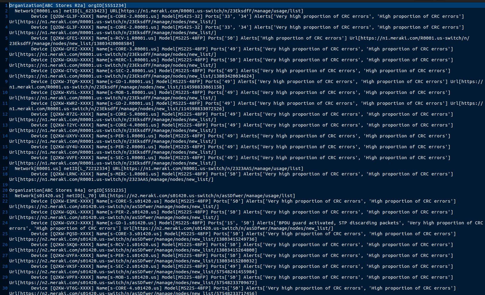

# getSwitchERR
Quick script to iterate through all available switches and output switches with CRC errors on uplink ports

**TO RUN:**
1. (FIRST TIME ONLY) run ./create_keys.py to generate a keyfile for your API, only have to do it once
2. (OPTIONAL) If you enter your org_id in the 'org_whitelist.txt' file, it'll only run against those orgs otherwise it'll do everything you have access to
3. run **./getSwitchERR.py** and it'll output to files "switch_CRC_errors_<timestamp>.txt" and "switch_CRC_errors_<timestamp>.json" with the results

**RESULT:**
You should get an output file which contains every network containing switches that have errors/warnings on their uplinks. The script will only report on switch ports that are connected to another switch (all members of port channels, STP interfaces, etc). Errors like CRC errors, UDLD, BPDU errors will show up here.

Switch port uplinks with excessive alerts/alarms can be disabled for maintenance or troubleshooting.

